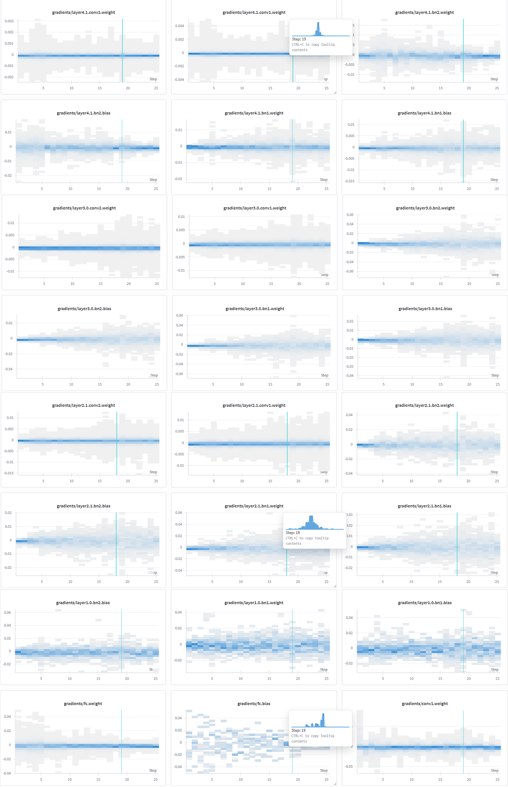
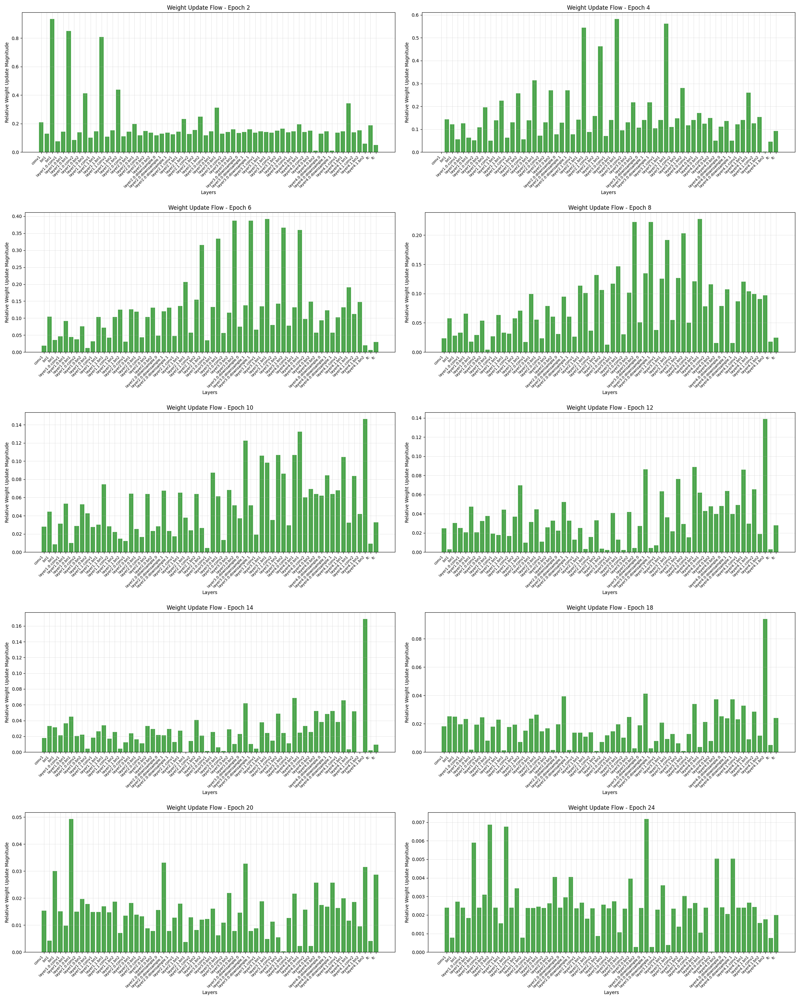
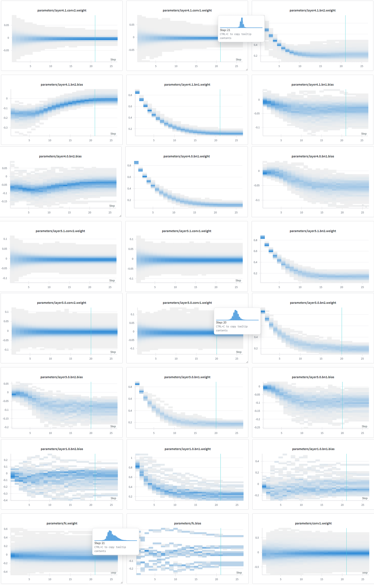

# ResNet-18 on CIFAR-10

This project trains a ResNet-18 model on the CIFAR-10 dataset using PyTorch. It monitors training progress, logs metrics to WandB, and visualizes gradient flow and weight updates.

### Report

## Model Statistics
- **Architecture**: ResNet-18 (customized for CIFAR-10)
- **Parameters**: 11.174M
- **FLOPs**: 557.889M

## Dataset Split
- **Train**: 40,000 images
- **Validation**: 10,000 images
- **Test**: 10,000 images

## Training Results
**Best Validation Accuracy: 92.15%** (Epoch 24)

### Training Progression
| Epoch | Train Loss | Train Acc | Val Loss | Val Acc | Learning Rate |
|-------|------------|-----------|----------|---------|---------------|
| 1     | 2.1214     | 24.38%    | 1.7948   | 35.39%  | 0.0996        |
| 5     | 0.9609     | 66.13%    | 0.9116   | 67.24%  | 0.0905        |
| 10    | 0.5221     | 82.01%    | 0.5502   | 80.83%  | 0.0655        |
| 15    | 0.3397     | 88.39%    | 0.4178   | 85.76%  | 0.0345        |
| 20    | 0.1604     | 94.50%    | 0.3117   | 89.95%  | 0.0095        |
| 24    | 0.0759     | 97.51%    | 0.2576   | **92.15%** | 0.0004     |
| 25    | 0.0682     | 97.92%    | 0.2596   | 92.09%  | 0.0000        |

## Visualizations

### Gradient Flow

### Weight Updates

### Weight Statistics

## Experiment Tracking
Training runs and metrics are tracked using **Weights & Biases**.
- **Project**: `cifar10-cnn-training`
- [View WandB Dashboard](https://wandb.ai/kishorevishal/cifar10-cnn-training)
